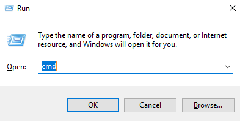

## Creating Node.js web app with Docker

Creating [Node.js](https://nodejs.org/en) app with [Docker](https://www.docker.com/) (or we can call it "Dockerizing Node.js app) This project is a week 6 assignment for any software engineer, developer, student building an app.js from Docker installed in Hardware. Before we go into details about building and running this Node.js app with Docker, there are two general steps on how we will Dockerize a Node.js web app. 

First thing first, we need to virtualized docker by installing Windows Subsystem for Linux (WSL) and [Docker](https://www.docker.com/). And the second part is creating Dockerizing the Node.js web app. In this case we will create images with an existing app that have already provided by my instructor.

## 🐳 Installing Docker 
1. Download [Docker](https://https://www.docker.com/) with klik button Download for Windows.
   
2. Wait until the download process  __Docker Desktop Installer.exe__ done. Then do install the application Double click.
   
3. Click Accept to continue the installation.
   
4. Restart your machine to finalize the installation.
   
5. Open your Terminal (ex :Command Prompt) and run it as an administrator. Or you can press __Windows + R__ on your keyboard and type `cmd`.
   
6. Type `docker --version` to check the Docker version and your installation is complete.
   

## 👨‍💻 Dockerizing Node.js App
1. Open VSCode, clone the repository from GitHub to your local storage, open the folder, and create a new file named ```app.js```.
2. Copy the simple node.js project from github [https://gist.github.com/berdoezt/e51718982926f0caa3fcd8ed45111430](https://gist.github.com/berdoezt/e51718982926f0caa3fcd8ed45111430) and paste it into your VSCode ```app.js```.
3. Create a new file named package.json that contains some information about the project.
   ```
   {
    "name": "web_app",
    "version": "1.0.0",
    "description": "Node.js on Docker",
    "author": "h-san8664",
    "main": "app.js",
    "scripts": {
      "start": "node server.js"
    },
    "dependencies": {
      "express": "^4.18.2"
    }
    }
   ```
4. Create a new file named ```Dockerfile``` that contains:
   * ```FROM``` : define from what image we want to build from.
   * ```WORKDIR``` : a directory to hold the application code inside the image.
   * ```COPY``` : copy files from the directory.
   * ```RUN``` : execute commands to build image.
   * ```EXPOSE``` : ports where the container will listen.
   * ```CMD``` : commands to run the container.

**1. Build the Image**
Here is the Dockerfile I created for this project:

   ```
      # Use Node.js as the base image
      FROM node:14

      # Set the working directory inside the container
      WORKDIR /usr/src/app

      # Copy package.json and package-lock.json into the container
      COPY package*.json ./

      # Install dependencies
      RUN npm install

      # Copy the entire application code into the container
      COPY . .

      # Specify the port that the application will use
      EXPOSE 3001

      # Run the application when the container is launched
      CMD ["node", "app.js"]

   ```

**2. Build the Image**

You can build a Docker image by running the following command in the terminal:
   
   ```
   docker build -t image-name:tag .
   ```

The `docker build` command is used to build a Docker image from a Dockerfile. Let's break down the command and explain each part:

- `docker`: This is the Docker command-line interface (CLI) that allows you to interact with Docker and manage containers and images.

- `build`: This subcommand tells Docker that we want to build an image.

- `-t image_name:tag`: The `-t` flag is used to tag the image with a name and optional tag. It allows you to give the image a human-readable name and a version or tag for easier identification and versioning. In this case, `image_name` represents the name of the image, and `tag` represents the version or tag of the image.

- `.`: The period (`.`) at the end of the command specifies the build context. It tells Docker to look for the Dockerfile in the current directory where the command is being executed.


**3. Run the Container**

After the image is built, you can run the container using the following command:

   ```
   docker run -p 3001:3001 image_name:tag
   ```

for this project, I used the following command:

   ```
   docker run -p 3001:3001 test-app:week-6
   ```

The `docker run` command is used to run a container from an image. Let's break down the command and explain each part:

- `docker`: This is the Docker command-line interface (CLI) that allows you to interact with Docker and manage containers and images.

- `run`: This subcommand tells Docker that we want to run a container.

- `-p 3001:3001`: The `-p` flag is used to publish a container's port(s) to the host. It allows you to expose a container's network port(s) to the host machine. In this case, `3001` represents the port on the host machine, and `3001` represents the port inside the container.

- `image_name:tag`: This is the name and tag of the image that you want to run in a container.
***
Week-6-h-san8664 created by GitHub Classroom
