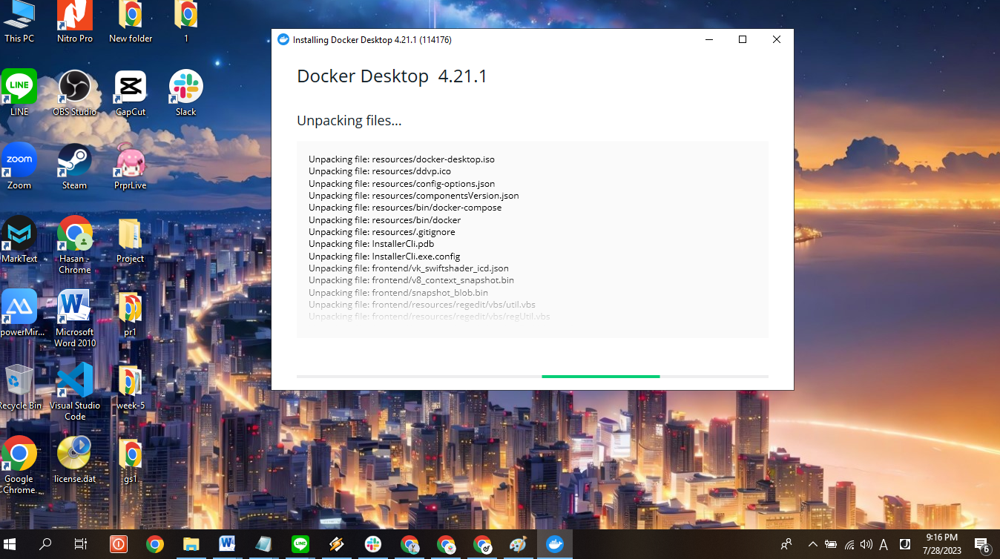

## Creating Node.js web app with Docker

Creating [Node.js](https://nodejs.org/en) app with [Docker](https://www.docker.com/) (or we can call it "Dockerizing Node.js app) can be a win-win solution for every software engineers, developers, students, etc, because of the _"it can be opened everywhere"_ trait, as long as the Docker installed within the Hardware. Before we jump into detail about creating and running this Node.js app with Docker, there are two general steps on how we are going to Dockerize the Node.js web app. 

First thing first, we need to virtualized docker by installing Windows Subsystem for Linux (WSL) and [Docker](https://www.docker.com/). And the second part is creating Dockerizing the Node.js web app. In this case we will create images with an existing app that have already provided by my instructor.

## 🐳 Installing Docker 
1. Download [Docker](https://https://www.docker.com/) with klik button Download for Windows.
   
2. Wait until the download process  __Docker Desktop Installer.exe__ done. Then do install the application Double click.
   
3. Click Accept to continue the installation.
   
4. Restart your machine to finalize the installation.
   
5. Open your Terminal (ex :Command Prompt) and run it as an administrator. Or you can press __Windows + R__ on your keyboard and type `cmd`.
   
6. Type `docker --version` to check the Docker version and your installation is complete.
   

## 👨‍💻 Dockerizing Node.js App

***
Week-6-h-san8664 created by GitHub Classroom
